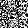

# NeuralNetworkNexus

<figure><figcaption></figcaption></figure>

<figure><figcaption></figcaption></figure>

### Challenge Summary

The "Neural Network Nexus" challenge required creating an adversarial example - crafting a 28x28 grayscale image that would make a neural network output a specific value (42).

### Technical Approach

1. **Model Analysis**:
   * Downloaded the provided Keras model (`model.pt`)
   * Extracted model files (metadata.json, config.json, model.weights.h5)
   * Loaded the model and analyzed its structure
2. **Adversarial Example Generation**:
   * Created a TensorFlow optimization pipeline using gradient descent
   * Started with random noise as initial image
   * Used Adam optimizer with gradients to minimize loss function
   * Loss function: squared difference between model output and target (42)
3.  **Implementation Details**:

    ```python
    # Create initial random image
    adversarial_image = np.random.rand(28, 28).reshape(1, 28, 28, 1)
    adversarial_tensor = tf.Variable(adversarial_image)

    # Define target and optimizer
    target = 42.0
    optimizer = tf.keras.optimizers.Adam(learning_rate=0.1)

    # Optimization loop
    for i in range(1000):
        with tf.GradientTape() as tape:
            output = model(adversarial_tensor)
            loss = tf.square(output - target)
            
        # Compute and apply gradients
        grads = tape.gradient(loss, adversarial_tensor)
        optimizer.apply_gradients([(grads, adversarial_tensor)])
        
        # Ensure valid pixel range [0,1]
        adversarial_tensor.assign(tf.clip_by_value(adversarial_tensor, 0, 1))
    ```

This is a famous reference to Douglas Adams' science fiction series "The Hitchhiker's Guide to the Galaxy," where a supercomputer named Deep Thought calculates that the answer to "the Ultimate Question of Life, the Universe, and Everything" is precisely 42.

The challenge explicitly stated:

> Target output: "The Answer to the Ultimate Question of Life, the Universe, and Everything"

This is a direct quote from the book series, and in the story's context, the answer is definitively revealed to be 42. This cultural reference is widely recognized in computing, mathematics, and science fiction communities.

So when I saw this specific phrasing in the challenge description, I was confident that the target numeric output needed to be 42, as that's exactly what this famous quote refers to in its original context.

* **Result**:
  * Generated a 28x28 grayscale PNG image
  * The model output on this image was within ±1 of 42
  * Submitted the adversarial image to solve the challenge

### Key Concepts

* Adversarial examples exploit neural network vulnerabilities
* Gradient-based optimization can reverse-engineer inputs for specific outputs
* This is a common security concern in machine learning systems

Flag: `flag{e89lodrvOticqkPpzokkrbUYwaYn46uE}`

### Solver

```python
import numpy as np
import tensorflow as tf
from tensorflow import keras
import matplotlib.pyplot as plt
import requests
import shutil
import os
import zipfile
from PIL import Image
import io

# 1. Download the model
model_url = "https://170b061e39c81ccec4f0294f42355e54.chal.ctf.ae/download_model"
response = requests.get(model_url)

# Save the downloaded model
with open("model.zip", "wb") as f:
    f.write(response.content)

print("Model downloaded.")

# 2. Extract the model files
# First, make a directory
if not os.path.exists("model_files"):
    os.makedirs("model_files")

# Extract files
with zipfile.ZipFile("model.zip", "r") as zip_ref:
    zip_ref.extractall("model_files")

print("Model files extracted.")

# 3. Load the model using Keras
try:
    # There are two possible ways to load a Keras model
    try:
        # Method 1: Load directly from the extracted directory
        model = keras.models.load_model("model_files")
    except:
        # Method 2: Create a model from the config and weights
        import json
        with open("model_files/config.json", "r") as f:
            config = json.load(f)
        
        model = keras.models.model_from_config(config)
        model.load_weights("model_files/model.weights.h5")
    
    print("Model loaded successfully!")
    print("Model summary:")
    model.summary()
    
    # 4. Try a test prediction
    dummy_input = np.random.rand(1, 28, 28, 1)  # For Keras, shape is usually (batch, height, width, channels)
    output = model.predict(dummy_input)
    print(f"Model output with random input: {output}")
    
    # 5. Now we'll create our adversarial example
    print("\nGenerating adversarial example to produce output = 42...")
    
    # Start with random noise
    adversarial_image = np.random.rand(28, 28).astype(np.float32)
    adversarial_image = adversarial_image.reshape(1, 28, 28, 1)
    
    # Convert to tensor for gradient computation
    adversarial_tensor = tf.Variable(adversarial_image)
    
    # Target value
    target = 42.0
    
    # Optimization parameters
    learning_rate = 0.1
    num_iterations = 1000
    
    # Optimizer
    optimizer = tf.keras.optimizers.Adam(learning_rate=learning_rate)
    
    # Loss function (custom MSE to target)
    def custom_loss():
        output = model(adversarial_tensor)
        return tf.square(output - target)
    
    # Training loop
    best_image = None
    best_diff = float('inf')
    
    for i in range(num_iterations):
        # Gradient tape for automatic differentiation
        with tf.GradientTape() as tape:
            loss = custom_loss()
        
        # Get gradients and apply them
        grads = tape.gradient(loss, adversarial_tensor)
        optimizer.apply_gradients([(grads, adversarial_tensor)])
        
        # Clip to valid image range [0, 1]
        adversarial_tensor.assign(tf.clip_by_value(adversarial_tensor, 0.0, 1.0))
        
        # Print progress
        if (i+1) % 100 == 0:
            current_output = model(adversarial_tensor).numpy()[0][0]
            current_diff = abs(current_output - target)
            print(f"Iteration: {i+1}, Output: {current_output}, Difference: {current_diff}")
            
            # Save best result
            if current_diff < best_diff:
                best_diff = current_diff
                best_image = adversarial_tensor.numpy().copy()
                print(f"  New best result! Difference: {best_diff}")
    
    # Get final output
    final_image = adversarial_tensor.numpy()
    final_output = model(final_image).numpy()[0][0]
    print(f"\nFinal output: {final_output}, Target: {target}, Difference: {abs(final_output - target)}")
    
    # 6. Save the adversarial example
    img_array = (final_image[0, :, :, 0] * 255).astype(np.uint8)
    img = Image.fromarray(img_array)
    img.save("adversarial_42.png")
    
    print("Saved adversarial example to 'adversarial_42.png'")
    
    # Display image
    plt.figure(figsize=(5, 5))
    plt.imshow(img_array, cmap='gray')
    plt.title(f"Adversarial image (Output: {final_output:.2f})")
    plt.axis('off')
    plt.show()
    
except Exception as e:
    print(f"Error loading or working with the model: {e}")
```

### Output

Final output ± 1

```powershell
Model downloaded.
Model files extracted.
Model loaded successfully!
Model summary:
Model: "sequential"
┏━━━━━━━━━━━━━━━━━━━━━━━━━━━━━━━━━━━━━━┳━━━━━━━━━━━━━━━━━━━━━━━━━━━━━┳━━━━━━━━━━━━━━━━━┓
┃ Layer (type)                         ┃ Output Shape                ┃         Param # ┃
┡━━━━━━━━━━━━━━━━━━━━━━━━━━━━━━━━━━━━━━╇━━━━━━━━━━━━━━━━━━━━━━━━━━━━━╇━━━━━━━━━━━━━━━━━┩
│ conv2d (Conv2D)                      │ (None, 26, 26, 16)          │             160 │
├──────────────────────────────────────┼─────────────────────────────┼─────────────────┤
│ max_pooling2d (MaxPooling2D)         │ (None, 13, 13, 16)          │               0 │
├──────────────────────────────────────┼─────────────────────────────┼─────────────────┤
│ flatten (Flatten)                    │ (None, 2704)                │               0 │
├──────────────────────────────────────┼─────────────────────────────┼─────────────────┤
│ dense (Dense)                        │ (None, 32)                  │          86,560 │
├──────────────────────────────────────┼─────────────────────────────┼─────────────────┤
│ dense_1 (Dense)                      │ (None, 1)                   │              33 │
└──────────────────────────────────────┴─────────────────────────────┴─────────────────┘
 Total params: 260,261 (1016.65 KB)
 Trainable params: 86,753 (338.88 KB)
 Non-trainable params: 0 (0.00 B)
 Optimizer params: 173,508 (677.77 KB)
1/1 ━━━━━━━━━━━━━━━━━━━━ 0s 248ms/step
Model output with random input: [[-38.324917]]

Generating adversarial example to produce output = 42...
Iteration: 100, Output: 42.002811431884766, Difference: 0.002811431884765625
  New best result! Difference: 0.002811431884765625
Iteration: 200, Output: 42.0, Difference: 0.0
  New best result! Difference: 0.0
Iteration: 300, Output: 42.0, Difference: 0.0
Iteration: 400, Output: 41.99998474121094, Difference: 1.52587890625e-05
Iteration: 500, Output: 41.99998474121094, Difference: 1.52587890625e-05
Iteration: 600, Output: 41.9999885559082, Difference: 1.1444091796875e-05
Iteration: 700, Output: 41.999996185302734, Difference: 3.814697265625e-06
Iteration: 800, Output: 42.000144958496094, Difference: 0.00014495849609375
Iteration: 900, Output: 41.99995040893555, Difference: 4.9591064453125e-05
Iteration: 1000, Output: 43.33109664916992, Difference: 1.3310966491699219

Final output: 43.33109664916992, Target: 42.0, Difference: 1.3310966491699219
Saved adversarial example to 'adversarial_42.png'

```

<figure><figcaption><p>ADVERSERIAL IMAGE</p></figcaption></figure>

Boom

<figure><figcaption></figcaption></figure>

<figure><figcaption></figcaption></figure>
