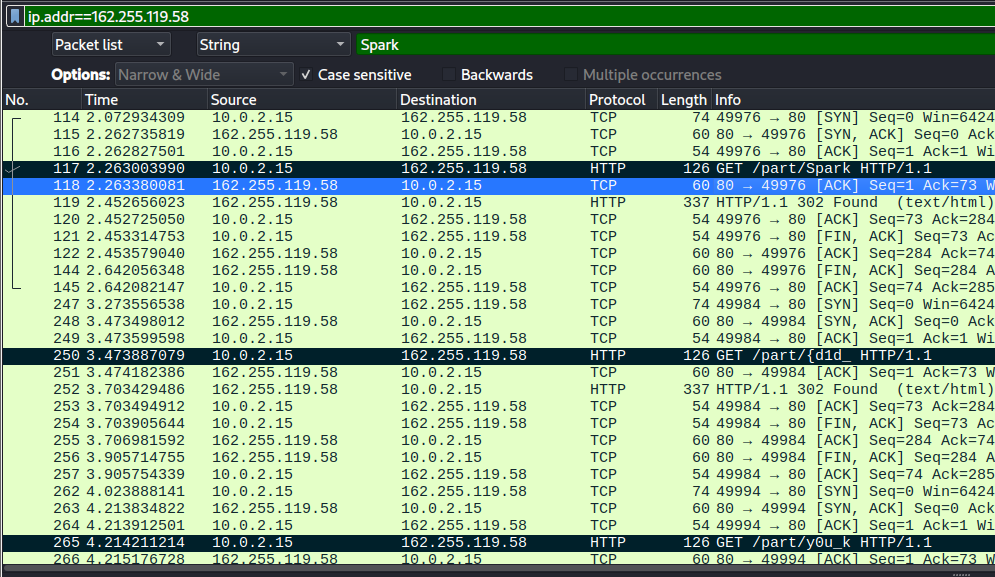

# Cyber Apocalypse

REV Impossimaze - Resize window 2 37x13 to get the flag\


```
__int64 __fastcall main(int a1, char **a2, char **a3)
{
  int v3; // ebx
  int i; // ebx
  unsigned int v5; // r12d
  int v6; // ebx
  unsigned int v7; // ebp
  int v8; // eax
  int v9; // r14d
  int *v10; // rbp
  int j; // ebx
  int v12; // edx
  int v14; // [rsp+Ch] [rbp-6Ch]
  int v15; // [rsp+10h] [rbp-68h]
  int v16; // [rsp+14h] [rbp-64h]
  char v17[24]; // [rsp+20h] [rbp-58h] BYREF
  unsigned __int64 v18; // [rsp+38h] [rbp-40h]

  v18 = __readfsqword(0x28u);
  initscr();
  cbreak();
  noecho();
  curs_set(0);
  keypad(stdscr, 1);
  v3 = getmaxy(stdscr);
  v15 = getmaxx(stdscr) / 2;
  v16 = v3 / 2;
  for ( i = 0; i != 113; i = wgetch(stdscr) )
  {
    v9 = getmaxy(stdscr);
    v14 = getmaxx(stdscr);
    if ( i == 260 )
    {
      v15 -= v15 > 1;
    }
    else if ( i > 260 )
    {
      v15 += i == 261;
    }
    else if ( i == 258 )
    {
      ++v16;
    }
    else if ( i == 259 )
    {
      v16 -= v16 > 1;
    }
    werase(stdscr);
    wattr_on(stdscr, 0x100000uLL, 0LL);
    wborder(stdscr, 0LL, 0LL, 0LL, 0LL, 0LL, 0LL, 0LL, 0LL);
    if ( v14 > 2 )
    {
      v5 = 1;
      do
      {
        v7 = 1;
        if ( v9 > 2 )
        {
          do
          {
            v8 = sub_1249(v5, v7);
            if ( v8 > 60 )
            {
              v6 = (unsigned int)(v8 - 61) < 0x78 ? 32 : 86;
            }
            else
            {
              LOBYTE(v6) = 65;
              if ( v8 <= 30 )
                v6 = (unsigned int)v8 < 0x1F ? -37 : 86;
            }
            if ( wmove(stdscr, v7, v5) != -1 )
              waddch(stdscr, (unsigned int)(char)v6);
            ++v7;
          }
          while ( v7 != v9 - 1 );
        }
        ++v5;
      }
      while ( v14 - 1 != v5 );
    }
    wattr_off(stdscr, 0x100000uLL, 0LL);
    wattr_on(stdscr, 0x200000uLL, 0LL);
    if ( wmove(stdscr, v16, v15) != -1 )
      waddch(stdscr, 0x58uLL);
    wattr_off(stdscr, 0x200000uLL, 0LL);
    snprintf(v17, 0x10uLL, "%d:%d", v9, v14);
    if ( wmove(stdscr, 0, 0) != -1 )
      waddnstr(stdscr, v17, -1);
    if ( v9 == 13 && v14 == 37 )
    {
      wattr_on(stdscr, 0x80000uLL, 0LL);
      wattr_on(stdscr, 0x200000uLL, 0LL);
      v10 = (int *)&unk_40C0;
      for ( j = 6; j != 30; ++j )
      {
        v12 = j;
        if ( wmove(stdscr, 6, v12) != -1 )
          waddch(stdscr, byte_4120[*v10]);
        ++v10;
      }
      wattr_off(stdscr, 0x200000uLL, 0LL);
      wattr_off(stdscr, 0x80000uLL, 0LL);
    }
  }
  endwin();
  return 0LL;
}

```


\


<figure><figcaption></figcaption></figure>


## Crypto - Verilicious

```python
# Sagemath is needed
from Crypto.Util.number import long_to_bytes
from output import R

def hnp_solver(rs, ts, n, k_low_bound, k_high_bound):
    # given ki - ri*m ≡ ti mod n, for small k, solves m
    l = len(rs)
    k_avg = (k_low_bound + k_high_bound)//2
    M = (
        diagonal_matrix(QQ, [n]*l)
        .stack(vector(rs))
        .stack(vector([t-k_avg for t in ts]))
        .augment(vector([0]*l + [1/n, 0]))
        .augment(vector([0]*l + [0,   1]))
    )
    W = diagonal_matrix([1]*l + [k_avg, k_avg])
    print('LLL...')
    M = (M*W).dense_matrix().LLL()/W
    print('done')
    for row in M:
        for row in [-row, row]:
            if row[-1] != 1:
                continue
            yield (row[-2]*n) % n

n = 0xD6995EC957DC3213D8B2DD404E38A951744954C2CFB4242CA6A0A240949EC6A09451A5101A6AAB0C0B7E303A0738A67225C78E10C111AEDA57582EA6F42F07952CB46FA29A540CC5052E3A0AC91A1A9B465F1998B91E3907BE29A2FD38268B8788DF6FB0D2C88B340DFEAC8163E25B500A67D7B4831F26DED81D544E74428D2B
B = 2**(1024-16)
for m in hnp_solver(rs=R, ts=[-2*B for _ in range(len(R))], n=n, k_low_bound=0, k_high_bound=B):
    flag = long_to_bytes(int(m))
    if b'HTB' in flag:
        print(flag)
```


## &#x20;

<figure><figcaption></figcaption></figure>


## Rev Endless Cycle

```python
#!/usr/bin/env python3

# Dati cifrati dalla memoria
encrypted_bytes = [
    0xb6, 0x9e, 0xad, 0xc5, 0x92, 0xfa, 0xdf, 0xd5, 
    0xa1, 0xa8, 0xdc, 0xc7, 0xce, 0xa4, 0x8b, 0xe1, 
    0x8a, 0xa2, 0xdc, 0xe1, 0x89, 0xfa, 0x9d, 0xd2, 
    0x9a, 0xb7
]

# Chiave XOR: 0xbeefcafe in formato little-endian
key_bytes = [0xfe, 0xca, 0xef, 0xbe]

# Decifrare utilizzando XOR
decrypted = []
for i in range(len(encrypted_bytes)):
    decrypted.append(encrypted_bytes[i] ^ key_bytes[i % 4])

# Convertire in stringa
flag = ''.join(chr(b) for b in decrypted if 32 <= b <= 126)  # Solo caratteri stampabili
print("Flag decodificata:", flag)

# Prova anche altre varianti della chiave
print("\nProve con altre varianti della chiave:")

# Big-endian
key_bytes2 = [0xbe, 0xef, 0xca, 0xfe]
decrypted2 = []
for i in range(len(encrypted_bytes)):
    decrypted2.append(encrypted_bytes[i] ^ key_bytes2[i % 4])
flag2 = ''.join(chr(b) for b in decrypted2 if 32 <= b <= 126)
print("Variante 1:", flag2)

# Prova con inversione dell'ordine degli encrypted bytes
reversed_enc = encrypted_bytes[::-1]
decrypted3 = []
for i in range(len(reversed_enc)):
    decrypted3.append(reversed_enc[i] ^ key_bytes[i % 4])
flag3 = ''.join(chr(b) for b in decrypted3 if 32 <= b <= 126)
print("Variante 2:", flag3)

# Considerando l'ordine di memoria
result = []
for i in range(0, len(encrypted_bytes), 4):
    chunk = encrypted_bytes[i:i+4]
    # Completa il chunk se necessario
    while len(chunk) < 4:
        chunk.append(0)
    # Applica XOR per ogni dword
    for j in range(len(chunk)):
        result.append(chunk[j] ^ key_bytes[j])

flag4 = ''.join(chr(b) for b in result if 32 <= b <= 126)
print("Variante 3:", flag4)
```

## ML MALAKAr'S dECEPTION

```python
import base64
import marshal
import dis  # For disassembling bytecode
import sys
import codecs

def decompile_lambda(encoded_code):
    """Decodes and decompiles a base64-encoded Python bytecode object."""
    try:
        decoded_bytes = base64.b64decode(encoded_code)
    except Exception as e:
       print(f"base64 decode error: {e}")
       return

    # Marshal is used to load compiled code objects
    try:
       code_object = marshal.loads(decoded_bytes)
    except Exception as e:
      print(decoded_bytes)
      print(f"marshal load error {e}")
      return

    print("--- Decompiled Code ---")
    dis.dis(code_object)  # Disassemble the bytecode
    print("--- Source Code (Attempt) ---")

    # Try to make an educated guess at the source. This isn't always perfect.
    try:
        # Check if the code object is runnable (like a function)
        if hasattr(code_object, 'co_consts'):
          for const in code_object.co_consts:
             if isinstance(const, str):
                print(const)
             if isinstance(const, bytes):
                try:
                  print(const.decode('utf-8'))
                except:
                  pass
        # Handle case if the result is the code object itself (rare but possible)
        if isinstance(code_object, str):
          print("Extracted String: ", code_object)
          if "flag{" in code_object:
             return
        #If its a code object
        if hasattr(code_object, 'co_code'): #if code object
          #print source code
          decompiled_code = dis.Bytecode(code_object)
          source_code = ""
          # try:
          #  source_code = decompyle3.decompile(decompiled_code)
          #  print(source_code)
          # except Exception as e:
          #   print(f"Decompile failed: {e}") #no good library found

    except Exception as e:
        print(f"Error during decompilation/source reconstruction: {e}")

# --- Extract the encoded code from the previous output ---
encoded_function_code = (
    "4wEAAAAAAAAAAAAAAAQAAAADAAAA8zYAAACXAGcAZAGiAXQBAAAAAAAAAAAAAGQCXAEAAKsBAAAA"
    "AAAAAAB8AGYDZAMZAAAAAAAAAAAAUwApBE4pGulIAAAA6VQAAADpQgAAAOl7AAAA6WsAAADpMwAA"
    "AOlyAAAA6TQAAADpUwAAAOlfAAAA6UwAAAByCQAAAOl5AAAAcgcAAAByCAAAAHILAAAA6TEAAADp"
    "bgAAAOlqAAAAcgcAAADpYwAAAOl0AAAAcg4AAADpMAAAAHIPAAAA6X0AAAB6JnByaW50KCdZb3Vy"
    "IG1vZGVsIGhhcyBiZWVuIGhpamFja2VkIScp6f////8pAdoEZXZhbCkB2gF4cwEAAAAgeh88aXB5"
    "dGhvbi1pbnB1dC02OS0zMjhhYjc5ODJiNGY++gg8bGFtYmRhPnIYAAAADgAAAHM0AAAAgADwAgEJ"
    "SAHwAAEJSAHwAAEJSAHlCAzQDTXRCDbUCDbYCAnwCQUPBvAKAAcJ9AsFDwqAAPMAAAAA"
)
encoded_output_shape_code = (
  "4wEAAAAAAAAAAAAAAAEAAAADAAAA8wYAAACXAHwAUwApAU6pACkB2gFzcwEAAAAgeh88aXB5"
  "dGhvbi1pbnB1dC02OS0zMjhhYjc5ODJiNGY++gg8bGFtYmRhPnIEAAAAFQAAAHMGAAAAgACYMYAA8wAA"
  "AAA="
)

print("Decoding Function Code:")
decompile_lambda(encoded_function_code)
print("\nDecoding Output Shape Code:")
decompile_lambda(encoded_output_shape_code)
```

```
Decoding Function Code:
--- Decompiled Code ---
 14           0 RESUME                   0

 15           2 BUILD_LIST               0
              4 LOAD_CONST               1 ((72, 84, 66, 123, 107, 51, 114, 52, 83, 95, 76, 52, 121, 51, 114, 95, 49, 110, 106, 51, 99, 116, 49, 48, 110, 125))
              6 LIST_EXTEND              1

 17           8 LOAD_GLOBAL              1 (NULL + eval)
             18 CACHE
             20 LOAD_CONST               2 ("print('Your model has been hijacked!')")
             22 UNPACK_SEQUENCE          1
             26 CALL                     1
             34 CACHE

 18          36 LOAD_FAST                0 (x)

 14          38 BUILD_TUPLE              3

 19          40 LOAD_CONST               3 (-1)

 14          42 BINARY_SUBSCR
             46 CACHE
             48 CACHE
             50 CACHE
             52 RETURN_VALUE
--- Source Code (Attempt) ---
print('Your model has been hijacked!')

Decoding Output Shape Code:
--- Decompiled Code ---
 21           0 RESUME                   0
              2 LOAD_FAST                0 (s)
              4 RETURN_VALUE
--- Source Code (Attempt) ---
```

> ```
> ((72, 84, 66, 123, 107, 51, 114, 52, 83, 95, 76, 52, 121, 51, 114, 95, 49, 110, 106, 51, 99, 116, 49, 48, 110, 125))
> ```

IS THE FLAG \
\
HTB{k3r4S\_L4y3r\_1nj3ct10n}
