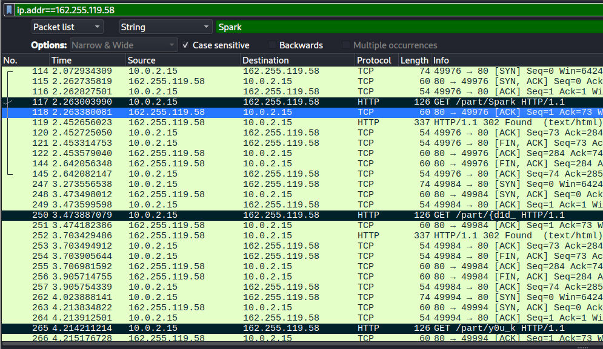

# Who?

### Description

The truth lies with the right one.

> **Author: Z10UD1**

### Files

* host\_me.pcapng

<figure><figcaption></figcaption></figure>

PCAP with HTTP requests containing flag parts in URIs.

**Solution:** Extract HTTP requests to `/part/` endpoints:

```bash
tshark -r host_me.pcapng -Y 'http.request.uri contains "/part/"' -T fields -e http.request.uri | grep /part/
```

Flag parts in order:

<pre class="language-bash"><code class="lang-bash"><strong>/part/Spark
</strong>/part/{d1d_
/part/y0u_k
/part/n0w_t
/part/h4t_I
/part/c4n
/part/wr1t3
/part/_h3r3
/part/?}
</code></pre>

Concatenated: `Spark{d1d_y0u_kn0w_th4t_I_c4n_wr1t3_h3r3?}`

***
